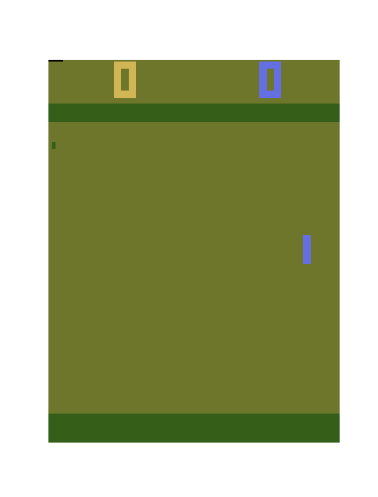
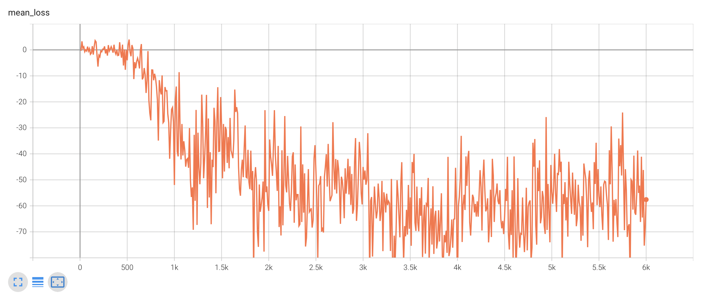
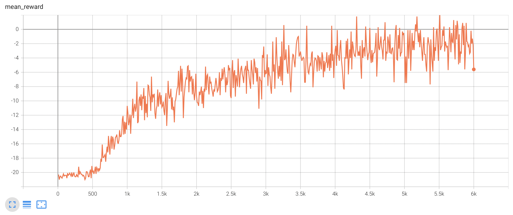

# Pong with policy gradients

Train an agent to play Pong using OpenAI Gym and policy gradient.

<p align="center">
  
</p>

## How to use
1. env setup
    ``` bash
    wget http://www.atarimania.com/roms/Roms.rar
    unrar x Roms.rar -y

    conda create -n pong python=3.10.0
    conda activate pong

    ale-import-roms ROMS/
    pip3 install -r requirements.txt
    ```
2. training
    ```bash
    # Train in the background
    nohup python3 train_pong.py > training.log 2>&1 &

    # Use the disown to prevent the process from receiving a SIGHUP (hangup) signal if you close the terminal.
    disown
    ```
3. check training process using tensorboard
    ```
    tensorboard --logdir=tensorboard_logs/
    ```
4. play pong using the trained agent
    ```bash
    python3 play_pong.py
    ```

## Training results
6000 episodes were used for training.
In the end, mean reward is approaching 0, which means that the trained agent is able to achieve a tie with the environment.

Training was done on CPU (Apple M1 Pro) only, and it tool around 14 hours to train the simple 3 layer policy network (linear & relu) using 6000 episodes. Memory consumption


Play Pong before vs after training


